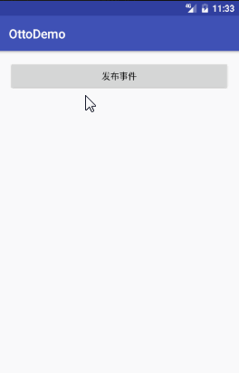

# Otto使用

开源地址：[https://github.com/square/otto](https://github.com/square/otto)

## 运行效果 ##

## 使用步骤

### 1. 在Module的build.gradle添加依赖

	compile 'com.squareup:otto:1.3.8'

### 2. 创建Bus的单例模式
	public class MyBus extends Bus{
	
	    private static MyBus sMyBus;
	
	    public static MyBus getInstance() {
	        if (sMyBus == null) {
	            synchronized (MyBus.class) {
	                if (sMyBus == null) {
	                    sMyBus = new MyBus();
	                }
	            }
	        }
	        return sMyBus;
	    }
	}
### 3. 注册和反注册Bus
    @Override
    protected void onCreate(Bundle savedInstanceState) {
        super.onCreate(savedInstanceState);
        setContentView(R.layout.activity_main);
        //注册到Bus
        MyBus.getInstance().register(this);
    }

    @Override
    protected void onDestroy() {
        super.onDestroy();
        //反注册Bus
        MyBus.getInstance().unregister(this);
    }

### 4. 创建事件

	public class MyEvent {
	    private String msg;
	
	    public MyEvent(String msg) {
	        this.msg = msg;
	    }
	
	    public String getMsg() {
	        return msg;
	    }
	
	    public void setMsg(String msg) {
	        this.msg = msg;
	    }
	}

	
### 5. 监听事件
    /**
     * 默认强制接收事件的方法在主线程执行
     */
    @Subscribe
    public void onEvent(MyEvent event) {
        Toast.makeText(this, event.getMsg(), Toast.LENGTH_SHORT).show();
    }

### 6. 发布事件
    public void onPublishEvent(View view) {
        MyBus.getInstance().post(new MyEvent("Hello Bus"));
    }

欢迎关注微信公众号

